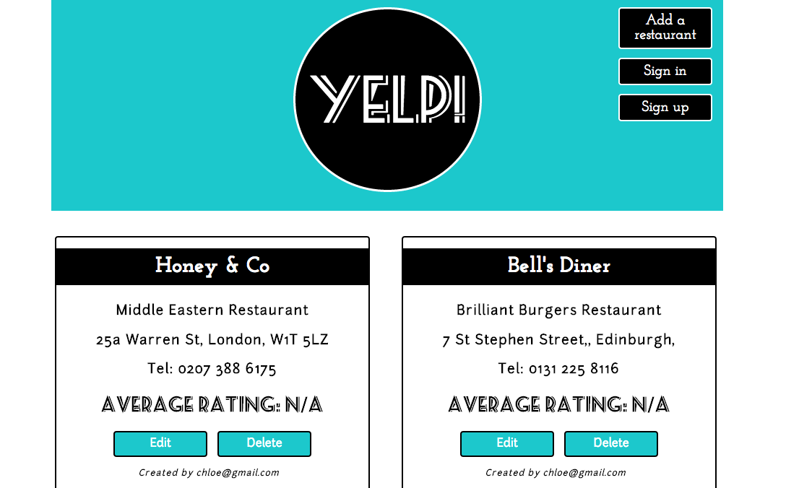

YELP
=========

As an introduction to Rails I created a restaurant review site.



####Deployed
To view, visit: http://blueyelp.herokuapp.com/

###Objectives

- Learn how to use TDD when developing Rails applications.
- Use the outside in testing approach; Capybara for Integration testing and RSpec for unit testing.


###Specifications

+ Users can sign up, log in, post restaurants & leave reviews.

###Technologies used

- Rails 4.1.4
- Ruby 2.1.2
- Postgresql
- 960. grid system

###Set up

```sh
git clone https://github.com/csharpd/yelp.git
cd yelp
bundle install
```

###Run

```sh
cd yelp
rails s
```
Open the browser at localhost:3000 to view the app

###Test

```sh
cd yelp
rspec
```


